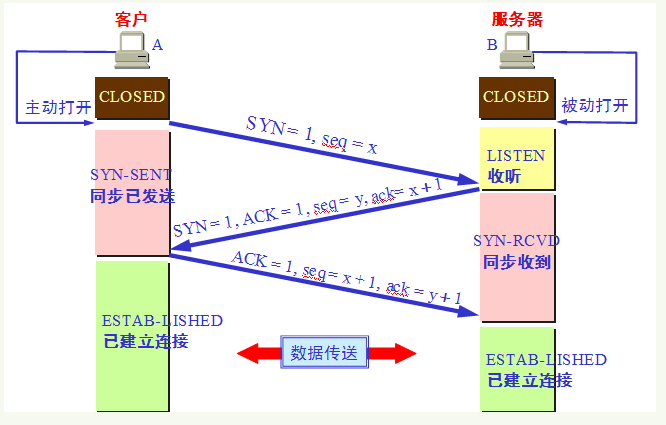

## 1. 为什么要三次握手 

三次握手的目的是建立可靠的通信信道，说到通讯，简单来说就是数据的发送与接收，而三次握手最主要的目的就是双方确认自己与对方的发送与接收是正常的。 

第一次握手：Client 什么都不能确认；Server 确认了对方发送正常，自己接收正常 
第二次握手：Client 确认了：自己发送、接收正常，对方发送、接收正常；Server 确认了：对方发送正常，自己接收正常 
第三次握手：Client 确认了：自己发送、接收正常，对方发送、接收正常；Server 确认了：自己发送、接收正常，对方发送、接收正常 所以三次握手就能确认双发收发功能都正常，缺一不可。

## 2. 三次握手流程

