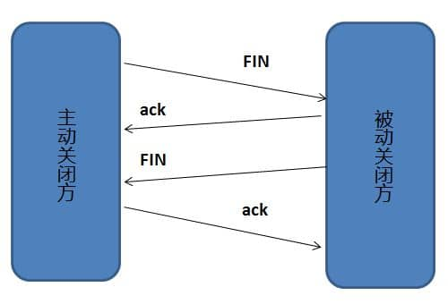

## 四次挥手流程

## 为什么要四次挥手

断开一个 TCP 连接则需要“四次挥手”： 
- 客户端-发送一个 FIN，用来关闭客户端到服务器的数据传送 
- 服务器-收到这个 FIN，它发回一 个 ACK，确认序号为收到的序号加 1 。和 SYN 一样，一个 FIN 将占用一个序号 
- 服务器-关闭与客户端的连接，发送一个 FIN 给客户端 
- 客户端-发回 ACK 报文确认，并将确认序号设置为收到序号加 1 

任何一方都可以在数据传送结束后发出连接释放的通知，待对方确认后进入半关闭状态。当另一方也没有数据再发送的时候，则发出连接释放通知，对方确认后就完全关闭了 TCP 连接。 

举个例子：A 和 B 打电话，通话即将结束后，A 说“我没啥要说的了”，B 回答“我知道了”，但是 B 可能还会有要说的话，A 不能要求 B 跟着自己的节奏结束通话，于是 B 可能又巴拉巴拉说了一通，最后 B 说“我说完了”，A 回答“知道了”，这样通话才算结束。