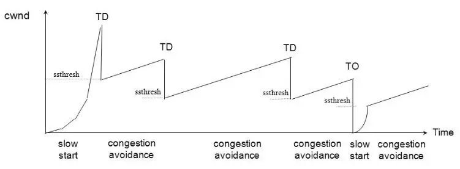

# 拥塞控制算法

1. Reno

    适用于低延时、低带宽的网络。
    Reno 将拥塞控制的过程分为四个阶段：慢启动、拥塞避免、快重传和快恢复

    - 慢启动阶段，在没有出现丢包时每收到一个 ACK 就将拥塞窗口大小加一（单位是 MSS，最大单个报文段长度），每轮次发送窗口增加一倍，呈指数增长，若出现丢包，则将拥塞窗口减半，进入拥塞避免阶段；当窗口达到慢启动阈值或出现丢包时，进入拥塞避免阶段，窗口每轮次加一，呈线性增长；当收到对一个报文的三个重复的 ACK 时，认为这个报文的下一个报文丢失了，进入快重传阶段，立即重传丢失的报文，而不是等待超时重传；快重传完成后进入快恢复阶段，将慢启动阈值修改为当前拥塞窗口值的一半，同时拥塞窗口值等于慢启动阈值，然后进入拥塞避免阶段，重复上诉过程

    

    - 拥塞避免,拥塞避免算法的思路是让拥塞窗口 cwnd 缓慢增大，即每经过一个往返时间 RTT 就把发送放的 cwnd 加 1

    - 快重传,快重传算法要求首先接收方收到一个失序的报文段后就立刻发出重复确认，而不要等待自己发送数据时才进行捎带确认。接收方成功的接受了发送方发送来的M1、M2并且分别给发送了ACK，现在接收方没有收到M3，而接收到了M4，显然接收方不能确认M4，因为M4是失序的报文段。如果根据可靠性传输原理接收方什么都不做，但是按照快速重传算法，在收到M4、M5等报文段的时候，不断重复的向发送方发送M2的ACK,如果接收方一连收到三个重复的ACK,那么发送方不必等待重传计时器到期，由于发送方尽早重传未被确认的报文段。
    
    

    - 快恢复, 当发送发连续接收到三个确认时，就执行乘法减小算法，把慢启动开始门限（ssthresh）减半，但是接下来并不执行慢开始算法。 此时不执行慢启动算法，而是把cwnd设置为ssthresh的一半， 然后执行拥塞避免算法，使拥塞窗口缓慢增大。

2. BBR

    BBR 是谷歌在 2016 年提出的一种新的拥塞控制算法

    ### BBR 算法不将出现丢包或时延增加作为拥塞的信号，而是认为当网络上的数据包总量大于瓶颈链路带宽和时延的乘积时才出现了拥塞，所以 BBR 也称为基于拥塞的拥塞控制算法
    
    （Congestion-Based Congestion Control）。BBR 算法周期性地探测网络的容量，交替测量一段时间内的带宽极大值和时延极小值，将其乘积作为作为拥塞窗口大小（交替测量的原因是极大带宽和极小时延不可能同时得到，带宽极大时网络被填满造成排队，时延必然极大，时延极小时需要数据包不被排队直接转发，带宽必然极小），使得拥塞窗口始的值始终与网络的容量保持一致。

    由于 BBR 的拥塞窗口是精确测量出来的，不会无限的增加拥塞窗口，也就不会将网络设备的缓冲区填满，避免了出现 Bufferbloat 问题，使得时延大大降低。如图 4 所示，网络缓冲区被填满时时延为 250ms，Cubic 算法会继续增加拥塞窗口，使得时延持续增加到 500ms 并出现丢包，整个过程 Cubic 一直处于高时延状态，而 BBR 由于不会填满网络缓冲区，时延一直处于较低状态。
